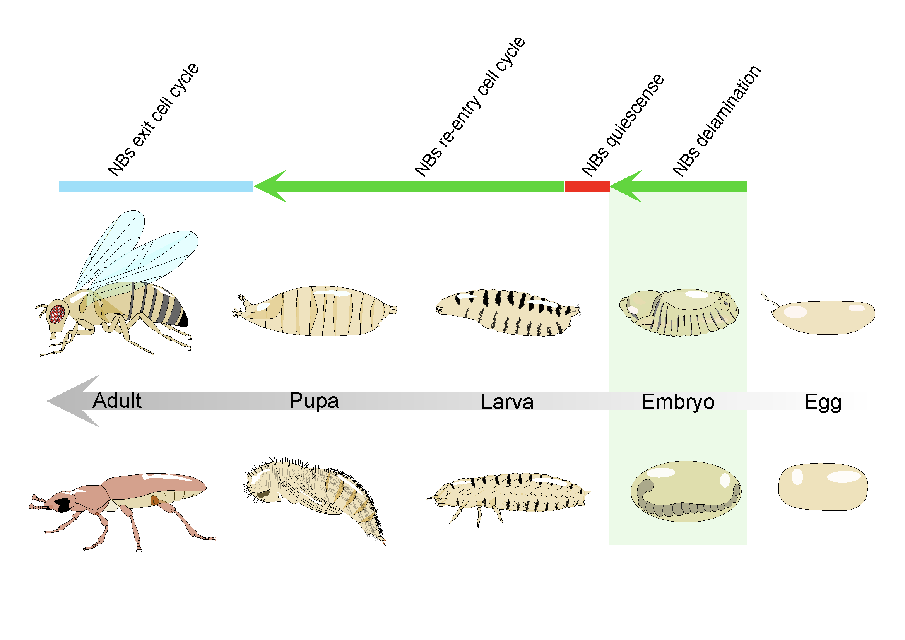

# 🧬 Single-cell Analysis of Insect Neuroblasts

  

This repository contains the computational workflows, analysis notebooks, and selected processed results generated for the study of insect neuroblasts using single-cell RNA sequencing.

The analyses focus on the identification, annotation, comparison, and evolutionary analysis of neuroblast populations in *Drosophila melanogaster* and *Tribolium castaneum*.

The repository contains the analyses used to investigate neuroblast populations, including transcription factor identification, species-specific single-cell analysis, cross-species dataset integration, cell-type annotation and label transfer, Gene Ontology and pathway enrichment, differential expression analysis, and comparative analysis of transcription factor repertoires.

This repository provides the computational resources required to reproduce and inspect the analyses presented in the associated manuscript.

---

## 📖 Table of Contents

* [Repository Overview](#-repository-overview)
* [Folder Descriptions](#-folder-descriptions)

  * [`1_TFs_predicted_and_annotated`](#1_tfs_predicted_and_annotated)
  * [`2_Drosophila_NBs_initial_downstream_analysis`](#2_drosophila_nbs_initial_downstream_analysis)
  * [`3_Tribolium_NBs_initial_downstream_analysis`](#3_tribolium_nbs_initial_downstream_analysis)
  * [`4_integration_Brain_NBs_datasets_and_annotation`](#4_integration_brain_nbs_datasets_and_annotation)
  * [`5_gene_ontology_analysis`](#5_gene_ontology_analysis)
  * [`6_pathways_enrichment_analysis`](#6_pathways_enrichment_analysis)
  * [`7_DE_analyses`](#7_de_analyses)
  * [`8_venn_diagrams_comparing_TFs_numbers`](#8_venn_diagrams_comparing_tfs_numbers)
* [Analysis Workflow](#-analysis-workflow)
* [Data Availability](#-data-availability)
* [Reproducibility](#-reproducibility)
* [Citation](#-citation)
* [License](#-license)
* [Contact](#-contact)

---

## 🧾 Repository Overview

This repository provides the computational analyses and selected processed results associated with a comparative single-cell RNA-sequencing study of insect neuroblasts.

The analyses compare neuroblast populations from *Drosophila melanogaster* and *Tribolium castaneum*, with particular emphasis on brain neuroblast identity, transcription factor repertoires, gene expression differences, and functional characteristics.

The repository is organised according to the major stages of the analysis workflow, from transcription factor identification and species-specific preprocessing to cross-species integration, functional enrichment, differential expression, and comparative transcription factor analysis.

---

## 📂 Folder Descriptions

### 1. `1_TFs_predicted_and_annotated`

Identification and annotation of transcription factors used throughout the downstream analyses.

This directory contains:

* Predicted and annotated transcription factor sets for *Drosophila melanogaster*.
* Predicted and annotated transcription factor sets for *Tribolium castaneum*.
* Reference transcription factor lists compiled from multiple databases and published resources.
* A Jupyter notebook documenting the pooling and selection of transcription factor candidates.

These resources provide the transcription factor sets used for subsequent comparative and differential-expression analyses.

---

### 2. `2_Drosophila_NBs_initial_downstream_analysis`

Initial downstream analysis of the *Drosophila melanogaster* neuroblast single-cell dataset.

The notebooks include:

* Dataset cleaning and filtering.
* Initial dimensionality reduction and exploration of neuroblast populations.
* Manual annotation of *Drosophila* brain neuroblasts.

These analyses establish the initial neuroblast populations and annotations used in subsequent analyses.

---

### 3. `3_Tribolium_NBs_initial_downstream_analysis`

Initial downstream analysis of the *Tribolium castaneum* neuroblast single-cell dataset.

The notebooks include:

* Dataset cleaning and filtering.
* Initial dimensionality reduction and comparison of neuroblast populations.
* Manual annotation of *Tribolium* brain neuroblasts.

These analyses establish the initial neuroblast populations and annotations used for subsequent cross-species comparisons.

---

### 4. `4_integration_Brain_NBs_datasets_and_annotation`

Integration and comparative annotation of brain neuroblast datasets from *Drosophila* and *Tribolium*.

This directory contains:

* The notebook used for integration and cross-species label transfer.
* Manual *Drosophila* brain neuroblast annotations.
* Resulting cell-type annotations obtained through cross-species label transfer.

This analysis provides the basis for identifying and comparing corresponding neuroblast populations between the two insect species.

---

### 5. `5_gene_ontology_analysis`

Gene Ontology enrichment analyses associated with the identified neuroblast populations.

The directory contains:

* The Gene Ontology analysis notebook.
* Biological Process GO slim results.
* Molecular Function GO slim results.

These analyses were used to characterise the functional properties of the identified neuroblast populations.

---

### 6. `6_pathways_enrichment_analysis`

Pathway-level functional analysis of genes associated with the analysed neuroblast populations.

The directory contains:

* A comprehensive gene-to-pathway annotation table.
* The notebook used for integrated pathway enrichment analysis of brain neuroblasts.

These analyses provide complementary functional characterisation of the neuroblast populations.

---

### 7. `7_DE_analyses`

Differential expression analyses performed independently for *Tribolium* and *Drosophila* neuroblast datasets.

The directory is divided into:

* `1_Tribolium_DE_notebooks`
* `2_Drosophila_DE_notebooks`

The analyses include differential expression between brain neuroblasts and VNC neuroblasts, analyses based on different numbers of pseudoreplicates, and analyses focused specifically on transcription factors.

Separate analyses were performed including and excluding Hox genes.

Processed differential-expression results are also provided as CSV files.

---

### 8. `8_venn_diagrams_comparing_TFs_numbers`

Comparative analysis of transcription factor numbers identified across the different analyses and species.

This directory contains:

* Transcription factor sets identified in *Drosophila*.
* Transcription factor sets identified in *Tribolium*.
* TF sets including and excluding Hox genes.
* Results from analyses using different numbers of pseudoreplicates.
* A notebook used to generate the Venn-diagram comparisons.

These analyses were used to compare transcription factor repertoires between species and across experimental conditions.

---

## 🔬 Analysis Workflow

The overall computational workflow can be summarised as:

1. **Transcription factor identification and annotation**
2. **Species-specific single-cell dataset preprocessing**
3. **Dimensionality reduction and neuroblast identification**
4. **Manual cell-type annotation**
5. **Cross-species dataset integration and label transfer**
6. **Gene Ontology enrichment**
7. **Pathway enrichment analysis**
8. **Differential expression analysis**
9. **Comparative analysis of transcription factor repertoires**

---

## 🧬 Data Availability

The raw single-cell RNA-sequencing data and raw count matrices associated with this study are available through the **NCBI Gene Expression Omnibus (GEO)** under accession:

**GSE337265**

The notebooks in this repository contain the computational analyses and selected processed results associated with the study.

Additional input data, genome annotations, transcription factor databases, and pathway resources used in individual analyses are described within the corresponding notebooks.

---

## 🔁 Reproducibility

The analyses are implemented primarily as Jupyter notebooks and use Python-based single-cell analysis workflows.

The notebooks are organised according to the analytical workflow. Some analyses require intermediate files generated by preceding steps.

Because individual analyses depend on external single-cell datasets, genome annotations, transcription factor databases, and pathway resources, users should consult the corresponding notebooks for details of the input datasets, software, parameters, and external resources used.

---

## 📄 Associated Publication

This repository contains the computational analyses associated with the following manuscript:

> **[MANUSCRIPT TITLE]**

> [Author 1], [Author 2], [Author 3], **Noel Cabañas**, et al.

*Manuscript in preparation.*

The manuscript investigates the cellular and molecular evolution of insect neuroblasts using comparative single-cell transcriptomics.

The publication information, including the final citation and DOI, will be added upon publication.

---

## 🧾 Citation

If you use the code, processed results, or analyses provided in this repository, please cite the associated publication:

> **[Full manuscript citation to be added upon publication]**

---

## 📜 License

This repository is distributed under the **GNU General Public License v3.0 (GPL-3.0)**, as specified in the accompanying `LICENSE` file.

---

## 📬 Contact

For questions regarding the analyses or repository, please contact:

**Noel Cabañas**
Department of Zoology,
University of Cambridge,
United Kingdom

---

**Last updated: August 2026**
